# MemeAR — Mobile AR Meme Camera (MVP)

MemeAR is a cross-platform (iOS + Android) mobile AR camera that observes a live scene
and drops contextually placed meme / reaction overlays into it with very low perceived
latency. This repository contains the **first working MVP**: a complete, on-device
real-time pipeline with a deterministic demo intelligence layer, built on **Unity +
AR Foundation** (ARKit on iOS, ARCore on Android).

The MVP runs the entire pipeline **with no network connection and no paid AI service**.
A built-in Simulation mode drives believable synthetic scenes so the whole
camera → perception → event → comedy → placement → render loop can be exercised without
a device or any ML model.

## What it does

On launch the app starts an AR camera session (or Simulation mode), maintains a live
scene-state model, detects simple "comedy opportunities," selects a reaction from a
bundled local catalog, decides *when* it should appear (comedic timing), places it in AR
or screen space, animates it in, holds it, and fades it out — with cooldowns to prevent
spam and a debug HUD exposing every stage.

## Pipeline

```mermaid
flowchart LR
    CAM[Camera / AR session] --> PERC[Perception<br/>real or simulated]
    PERC --> SNAP[SceneSnapshot<br/><i>central boundary</i>]
    SNAP --> REL[Relation extraction]
    REL --> TEMP[Temporal memory<br/>frames ~1s / events ~20s]
    TEMP --> PRED[Prediction<br/>potential events]
    TEMP --> EV[Event engine]
    PRED --> CACHE[Reaction candidate cache<br/><i>prefetch</i>]
    EV --> OPP[Comedy opportunity scoring]
    OPP --> SEL[Retrieve + rank<br/>uses cache if warm]
    CACHE --> SEL
    SEL --> TIME[Comedic timing engine]
    TIME --> DIR[AR director]
    DIR --> INSTR[MemeRenderInstruction<br/><i>declarative</i>]
    INSTR --> REND[Pooled renderer]
```



**`SceneSnapshot` is the central boundary.** Everything to its left (real perception or
the simulator) is swappable; everything to its right is shared. That is what lets real
ML/VLM/LLM models be dropped in later without rewriting the AR app.

## Comedic timing is a product feature, not a side effect

The architecture strictly separates two kinds of delay:

- **Computational latency** — minimized. Measured per stage in the debug HUD; the design
  target is trigger-to-render < 100 ms on device.
- **Comedic delay** — *deliberately* configurable. Only the timing engine
  (`ComedyTimingPolicy`) introduces it, sampled from configured ranges
  (Instant 0–80 ms, ShortBeat 100–300 ms, DelayedReaction 300–800 ms). It never blocks a
  thread — reactions are *scheduled* against a timestamp.

Model, network, or compute latency is **never** used as the mechanism for comedic timing.
Events follow a `Setup → Anticipation → Trigger → (optional beat) → Punchline → Cooldown`
lifecycle; anticipation lets candidates be **prefetched** before the trigger confirms, so
the punchline path never waits on retrieval, ranking, or (later) a remote service.

## Project layout

```
Assets/App/
  AR/            AR + camera abstractions (ICameraSceneProvider, IARSpatialProvider) + AR Foundation impl
  Perception/    perception module interfaces + observation/cue data structures (simulated for MVP)
  Scene/         SceneSnapshot, TrackedPerson/Object, relations, relation extractor
  Temporal/      ring buffer, temporal scene buffer, session state
  Events/        event types/phases, detectors, event engine
  Prediction/    potential events + heuristic predictor
  Comedy/        opportunity scoring
  Memes/         MemeDefinition / MemeCatalog (ScriptableObjects) + bundled placeholder catalog
  Retrieval/     retriever, ranker, reaction candidate (prefetch) cache
  Timing/        comedic timing policy + decision
  Placement/     placement modes + solver
  Rendering/     MemeRenderInstruction, validator, AR director, pooled renderer, card view
  Remote/        future cloud response schema (declarative, no networking)
  Simulation/    simulated spatial + observation providers (Scenarios A/B/C)
  Capture/       screenshot service
  Debug/         developer HUD
  Pipeline/      MemePipeline (pure C# orchestrator), factory, telemetry
  App/           AppController (composition root) + zero-asset bootstrap
Assets/Tests/EditMode/   NUnit EditMode tests for all non-Unity-heavy logic
docs/            DECISIONS.md, DEVICE_TESTING.md, FUTURE_CLOUD_SCHEMA.md
```

Namespaces mirror folders (`MemeAR.<Module>`). Meme logic never references AR Foundation
directly — it goes through the AR abstraction interfaces.

## Requirements

- **Unity `2022.3 LTS`** (developed against `2022.3.40f1`). See `ProjectSettings/ProjectVersion.txt`.
- Packages are declared in `Packages/manifest.json` and resolve automatically on open:
  - `com.unity.xr.arfoundation` 5.1.5
  - `com.unity.xr.arkit` 5.1.5 (iOS)
  - `com.unity.xr.arcore` 5.1.5 (Android)
  - `com.unity.xr.management`, `com.unity.inputsystem`, `com.unity.ugui`,
    `com.unity.test-framework`

## Open the project

1. Install Unity `2022.3 LTS` with **iOS Build Support** and **Android Build Support**
   (SDK/NDK/JDK) via Unity Hub.
2. Open this repository folder in Unity Hub. First import restores packages and generates
   `.meta` files.

## Run Simulation mode (no device needed)

Simulation mode requires **no scene setup**. Press **Play** in any scene (even an empty
one): a runtime bootstrap builds the rig automatically and starts in Simulation mode.

- The debug HUD (top-left) shows FPS, scene counts, predicted/confirmed events, the
  opportunity score, the selected meme, the comedic delay, trigger-to-visible latency,
  cooldown, and per-stage compute timings.
- Use the **Mode** button to toggle Simulation ⟷ LiveAR, and **Screenshot** to capture.
- The simulator cycles three scenarios: **A: Snack Heist** (a reach-for-food event),
  **B: All Eyes** (group attention converges on an object), **C: Sudden Motion**.

To customize, create a config asset via **Assets ▸ Create ▸ MemeAR ▸ Config**, put it in a
`Resources/` folder named `MemeArConfig`, and tune values there (or assign it to an
`AppController` in your own scene).

### Meme content (cards, clips, packs)

Reactions can be **generated animated cards** (default, zero-asset), **still sprites**, or
**video clips with audio** composited onto the camera feed (with chroma-key/alpha background
blending). Content is source-agnostic — see **`docs/MEDIA_PACKS.md`** to drop your own clips
into `Assets/StreamingAssets/MemePacks/<pack>/` with a small JSON manifest and a footer
attribution. Within a scene the app locks onto one **pack** so reactions stay tonally
consistent; if a clip can't load it falls back to the dialogue text card. Audio is mutable
from the HUD.

> Copyright: the footer attribution is **credit, not a license**. The app bundles only
> original placeholder cards; provision any real viral/film clips as user packs you have the
> right to use (licensed / royalty-free / CC / original). Details in `docs/MEDIA_PACKS.md`.

## Build for iOS

1. **File ▸ Build Settings ▸ iOS ▸ Switch Platform**.
2. **Project Settings ▸ XR Plug-in Management**: enable **ARKit** for iOS.
3. **Project Settings ▸ Player ▸ iOS**:
   - Set a **Camera Usage Description** (required — the app is denied camera access without it).
   - Target minimum iOS **12.0+**, architecture **ARM64**.
4. For a real AR scene, add an `AR Session`, an `XR Origin (AR)` with an `AR Camera`, an
   `AR Plane Manager`, attach `ARFoundationProvider` to the AR Camera, and reference it
   from an `AppController` (`mode = LiveAR`). See `docs/DEVICE_TESTING.md`.
5. **Build** → open the generated Xcode project → sign with your team → run on device.

## Build for Android

1. **File ▸ Build Settings ▸ Android ▸ Switch Platform**.
2. **Project Settings ▸ XR Plug-in Management**: enable **ARCore** for Android.
3. **Project Settings ▸ Player ▸ Android**:
   - Minimum API level **24+**, **ARM64** (IL2CPP), and remove the *Vulkan*-only graphics
     API if your device requires OpenGLES3 for ARCore (leave OpenGLES3 present).
   - Camera permission is added by the ARCore package.
4. Same AR scene wiring as iOS.
5. **Build** the APK/AAB and deploy to an ARCore-supported device.

## What still requires real-device validation

The cloud/CI environment cannot exercise ARKit/ARCore, the camera, or on-device
performance. Everything from `SceneSnapshot` onward is validated by Simulation mode and
the EditMode tests, but the following must be checked on hardware — see
**`docs/DEVICE_TESTING.md`** for the full checklist:

- Camera permission prompts, AR session start, plane detection, world anchoring.
- Real trigger-to-visible latency, FPS, frame drops (p95/p99), thermal/memory behavior.
- Screenshot capturing the composited camera + overlay frame.
- Background/foreground and session-interruption handling.

## Known MVP limitations

- Live perception is not yet implemented: in LiveAR mode the scene has camera pose +
  planes but **no people/objects** until on-device detectors are added. Simulation mode
  demonstrates the full people/object pipeline.
- Reaction cards/clips render in a screen-space overlay; world-anchored reactions are
  projected to screen each frame (robust, but not a true world-space mesh billboard yet).
- Bundled content is original placeholder cards; real video/audio clips are supported but
  supplied as user packs (see `docs/MEDIA_PACKS.md`) — none are shipped.
- Android reads `StreamingAssets` from inside the APK; a production Android build should
  stream pack clips via `UnityWebRequest` (manifest/parser are already platform-independent).
- No persistence, no networking, no cloud AI.

## Next engineering milestones

1. On-device person detection + tracking (`IPersonDetector`/`IPersonTracker`) via
   MediaPipe / Core ML / LiteRT behind the existing interfaces.
2. Pose, facial-cue, gaze, and object detectors feeding the same `SceneSnapshot`.
3. True world-space billboard rendering with anchors and depth occlusion.
4. Richer placement scoring (screen occupancy, edges, overlap avoidance, visibility).
5. Optional slow cloud "semantic context" path that pre-warms candidates but stays out of
   the punchline critical path (see `docs/FUTURE_CLOUD_SCHEMA.md`).

## Privacy

No facial recognition, no persistent identity, no sensitive-characteristic inference.
People get ephemeral session-local IDs (P1, P2…). Camera frames are never persisted or
uploaded in this MVP. Facial *cues* are represented probabilistically as observable
signals, never as objective internal emotional state. Remote analysis is designed behind
an explicit interface so consent/privacy controls can be added before any such feature ships.

## Testing

EditMode tests cover the non-Unity-heavy core logic: ring/temporal buffers, event state
transitions, opportunity scoring, cooldowns, retrieval/ranking, duplicate suppression, the
candidate cache, timing policy, placement fallback, deterministic randomness, render
instruction validation, and a headless end-to-end pipeline run.

Run them in Unity via **Window ▸ General ▸ Test Runner ▸ EditMode ▸ Run All**, or headless:

```
Unity -runTests -batchmode -projectPath . -testPlatform EditMode -testResults results.xml
```
